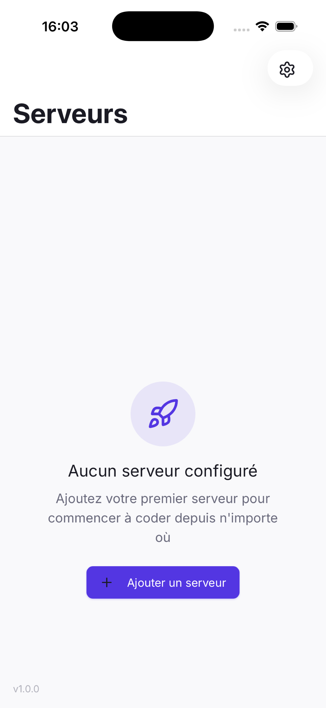
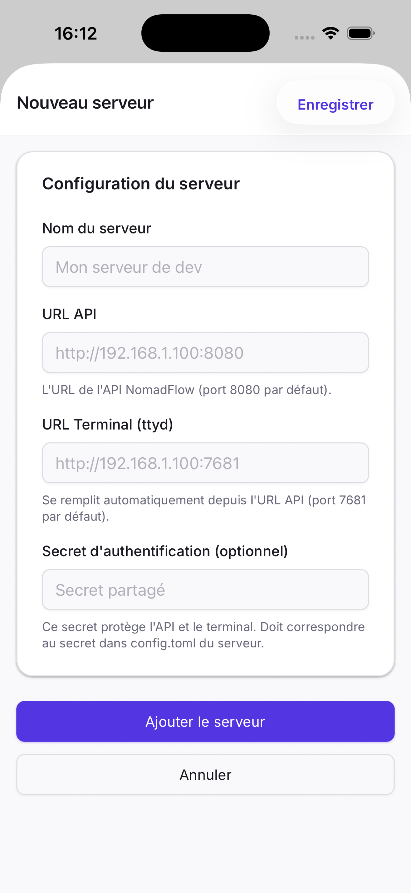
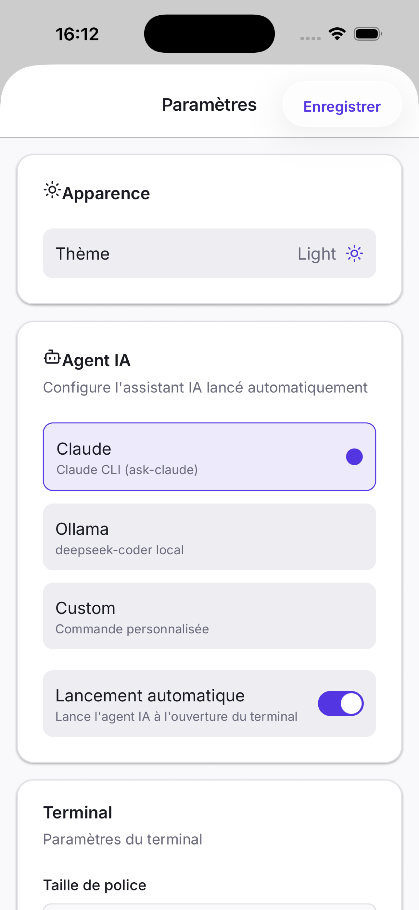

# NomadFlow

**Code from anywhere — mobile terminal & workflow manager for nomad developers**

NomadFlow is an open-source platform that turns your phone into a full development environment. A single Rust binary manages git worktrees, tmux sessions, and a web terminal, while the React Native app lets you seamlessly switch between projects from your pocket.


## Features

### Instant Workflow
- **3-step selection**: Server → Repo → Feature → Terminal ready
- **Zero manual commands**: environment auto-configured with git worktrees + tmux
- **Branch management**: create, switch, and manage branches from your phone

### Mobile App
- **iOS & Android** via React Native / Expo
- **Integrated terminal** powered by ttyd with WebSocket proxy
- **Session persistence** via tmux — reconnect where you left off
- **Command shortcuts**: quick bar with customizable terminal commands
- **Deep linking**: connect to a server via `nomadflowcode://connect?url=...&secret=...`

### Server (Single Rust Binary)
- **All-in-one**: HTTP API + TUI wizard + daemon mode in one binary
- **Interactive TUI**: ratatui-based wizard to manage servers, repos, and features
- **Daemon mode**: `nomadflow start` / `nomadflow stop` for background operation
- **Graceful shutdown**: no orphan processes on Ctrl+C or SIGTERM
- **Public tunnels**: expose your server via `--public` with automatic subdomain routing

### Secure Connection
- **Shared secret authentication**: single secret protects both API and terminal
- **Bearer + Basic Auth**: API uses Bearer token, terminal uses Basic Auth (same secret)
- **WebSocket proxy**: terminal WS goes through the server (handles iOS WKWebView auth)

## Screenshots

<p align="center">
  
  &nbsp;&nbsp;
  
  &nbsp;&nbsp;
  
</p>

## Quick Start

### Install the CLI

**macOS / Linux:**
```bash
curl --proto '=https' --tlsv1.2 -LsSf https://github.com/fab-uleuh/NomadFlowCode/releases/latest/download/nomadflow-installer.sh | sh
```

**From source (requires Rust):**
```bash
git clone https://github.com/fab-uleuh/NomadFlowCode.git
cd NomadFlowCode/nomadflow-rs
cargo install --path .
```

### Uninstall

**If installed via the installer script:**
```bash
~/.cargo/bin/nomadflow --version  # verify location
rm ~/.cargo/bin/nomadflow
```

**If installed via `cargo install`:**
```bash
cargo uninstall nomadflow
```

**Remove configuration (optional):**
```bash
rm -rf ~/.nomadflowcode
```

### Usage

```bash
# Launch the TUI wizard (server + interactive interface)
nomadflow

# Launch HTTP server in foreground
nomadflow serve

# Expose publicly via tunnel
nomadflow serve --public

# Start/stop as a background daemon
nomadflow start
nomadflow stop

# Display tmux and daemon status
nomadflow --status

# Attach directly to a feature session
nomadflow --attach <feature>
```

### Configuration

The configuration file is created automatically on first launch:

```toml
# ~/.nomadflowcode/config.toml

[paths]
base_dir = "~/.nomadflowcode"

[tmux]
session = "nomadflow"

[ttyd]
port = 7681

[api]
port = 8080

# Uncomment to enable authentication
# [auth]
# secret = "your-secret-here"
```

### Mobile App

```bash
cd NomadFlowCode/nomadflowcode
pnpm install
pnpm run ios    # or: pnpm run android
```

## Architecture

```
┌─────────────────────────────────────────────────────────┐
│                    Mobile App                           │
│  ┌──────────┐  ┌──────────┐  ┌──────────┐  ┌────────┐ │
│  │ Servers  │→ │  Repos   │→ │ Features │→ │Terminal│ │
│  └──────────┘  └──────────┘  └──────────┘  └────────┘ │
│       │                                         │      │
│       └──────────── HTTP + WebSocket ────────────┘      │
└────────────────────────┬────────────────────────────────┘
                         │
                         ▼
┌─────────────────────────────────────────────────────────┐
│              Server (nomadflow binary)                  │
│  ┌──────────────────────────────────────────────────┐  │
│  │              Axum HTTP Server                     │  │
│  │  /api/list-repos  /api/list-features  /health     │  │
│  │  /api/create-feature  /api/switch-feature         │  │
│  │  /api/clone-repo  /api/list-branches              │  │
│  │  /terminal (proxy)  /terminal/ws (WS proxy)       │  │
│  └──────────────────────┬───────────────────────────┘  │
│                         │                               │
│  ┌──────────────────────▼───────────────────────────┐  │
│  │                    ttyd + tmux                    │  │
│  │  ┌─────────┐  ┌─────────┐  ┌─────────┐          │  │
│  │  │ repo:   │  │ repo:   │  │ repo:   │  ...     │  │
│  │  │feature-a│  │feature-b│  │  main   │          │  │
│  │  └────┬────┘  └────┬────┘  └────┬────┘          │  │
│  └───────┼────────────┼────────────┼────────────────┘  │
│          ▼            ▼            ▼                    │
│     Git Worktrees (isolated directories per branch)    │
└─────────────────────────────────────────────────────────┘

                    ┌─────────────┐
                    │ Bore Relay  │  (optional, --public)
                    │ Tunnel via  │
                    │ subdomain   │
                    └─────────────┘
```

## Project Structure

```
NomadFlowCode/
├── nomadflow-rs/               # Rust binary (single binary: server + TUI)
│   ├── src/main.rs             # Entry point, CLI args, daemon mode
│   ├── crates/
│   │   ├── nomadflow-core/     # Config, models, shell, git/tmux/ttyd services
│   │   ├── nomadflow-server/   # Axum HTTP server with auth middleware
│   │   ├── nomadflow-tui/      # Ratatui TUI wizard
│   │   ├── nomadflow-relay/    # Standalone relay server for tunnel routing
│   │   └── nomadflow-ws/       # WebSocket utilities
│   └── Cargo.toml
├── nomadflowcode/              # React Native/Expo mobile app
├── docs/                       # Documentation site (Next.js/fumadocs)
└── README.md
```

## Prerequisites

### Server
- macOS or Linux
- **tmux** (terminal multiplexer)
- **ttyd** (web terminal)
- **Git** with worktree support

### Mobile
- Node.js 18+
- pnpm
- Xcode (iOS) or Android Studio (Android)

## Security

### Shared Secret Authentication

NomadFlow uses a single shared secret that protects both:
- **REST API**: via Bearer token (`Authorization: Bearer <secret>`)
- **Terminal**: via Basic Auth (user: `nomadflow`, password: `<secret>`)

**Setup:**

1. **Server** — add to `~/.nomadflowcode/config.toml`:
```toml
[auth]
secret = "your-secure-secret"
```

2. **Mobile** — enter the same secret when adding a server in the app.

Without a secret configured, everything works without authentication (suitable for local development).

### Recommendations

1. **Use HTTPS** in production (or tunnels with `--public`)
2. **Enable authentication** with a strong secret
3. **Firewall**: don't expose ports publicly without VPN or tunnel
4. **Public access**: use `nomadflow serve --public` for automatic HTTPS tunnels

## Contributing

Contributions are welcome!

1. Fork the project
2. Create your branch (`git checkout -b feature/amazing-feature`)
3. Commit your changes (`git commit -m 'Add amazing feature'`)
4. Push (`git push origin feature/amazing-feature`)
5. Open a Pull Request

## License

MIT License — see [LICENSE](LICENSE) for details.

## Acknowledgements

- [ttyd](https://github.com/tsl0922/ttyd) — Web terminal
- [tmux](https://github.com/tmux/tmux) — Terminal multiplexer
- [axum](https://github.com/tokio-rs/axum) — Rust web framework
- [ratatui](https://github.com/ratatui/ratatui) — Terminal UI framework
- [bore](https://github.com/ekzhang/bore) — TCP tunnel
- [React Native](https://reactnative.dev/) — Mobile framework
- [Expo](https://expo.dev/) — React Native toolchain

---

**Made with love for nomad developers**
