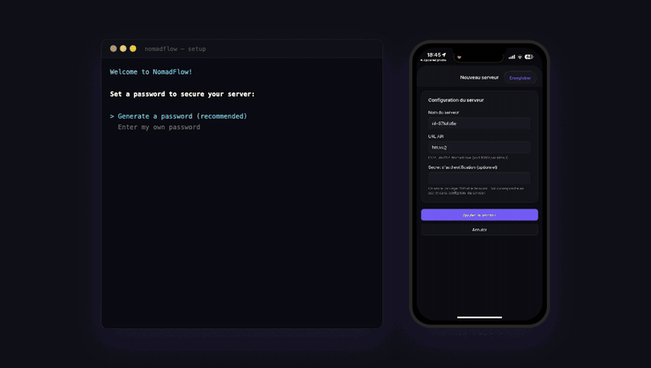
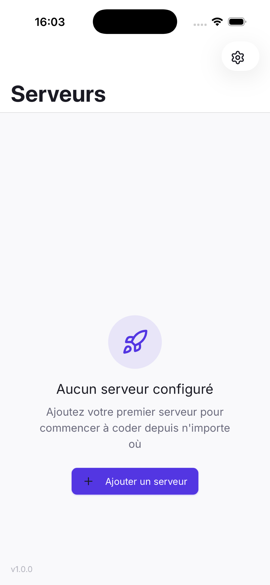
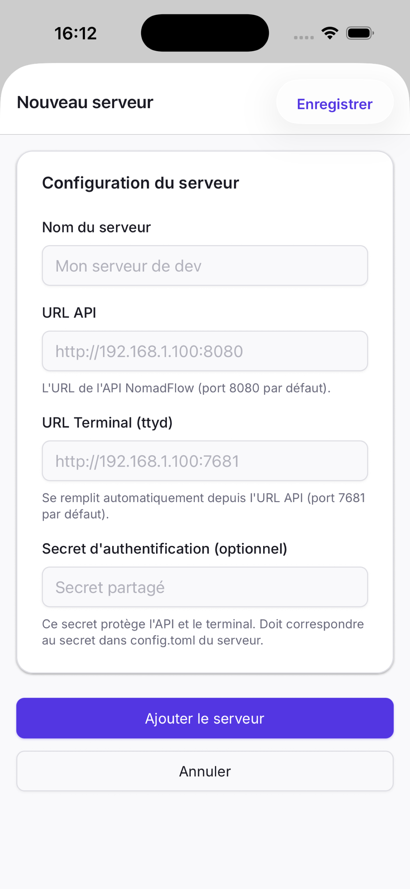
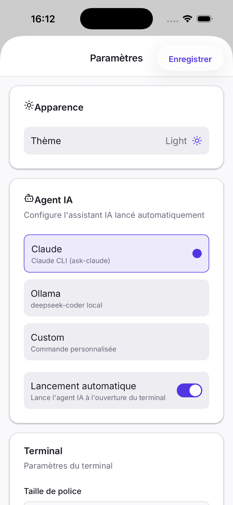

# NomadFlow

**Code from anywhere — mobile terminal & workflow manager for nomad developers**

NomadFlow is an open-source platform that turns your phone into a full development environment. A single Rust binary manages git worktrees, Rust-native PTY sessions, and a real-time terminal, while the React Native app lets you seamlessly switch between projects from your pocket.


[Documentation](https://nomadflowcode.dev) | [Getting Started](https://nomadflowcode.dev/docs/getting-started) | [API Reference](https://nomadflowcode.dev/docs/server/api)

<p align="center">
  
</p>

## Features

### Instant Workflow
- **3-step selection**: Server → Repo → Feature → Terminal ready
- **Zero manual commands**: environment auto-configured with git worktrees
- **Branch management**: create, switch, and manage branches from your phone

### Mobile App
- **iOS & Android** via React Native / Expo
- **Multiplexed terminal** powered by xterm.js with binary protocol over a single WebSocket
- **Session persistence**: Rust-native PTY multiplexer keeps your terminal sessions alive
- **Command shortcuts**: quick bar with customizable terminal commands
- **Deep linking**: scan a QR code or use `nomadflowcode://add-server?url=...&secret=...`

### Server (Single Rust Binary)
- **All-in-one**: HTTP API + PTY multiplexer + TUI wizard + daemon mode in one binary
- **Interactive TUI**: ratatui-based setup wizard and session management
- **Native PTY multiplexer**: high-performance terminal panes without external dependencies (no tmux, no ttyd)
- **Multiplexed WebSocket**: multiple terminal panes over a single connection at `/ws/panes`
- **Daemon mode**: `nomadflow start` / `nomadflow stop` for background operation
- **Graceful shutdown**: no orphan processes on Ctrl+C or SIGTERM
- **Public tunnels**: expose your server via `--public` with automatic HTTPS subdomain routing

### Secure Connection
- **Shared secret authentication**: single secret protects both API and terminal
- **Bearer token & Basic Auth**: flexible authentication for API and WebView
- **WebSocket subprotocol auth**: terminal secured via `Sec-WebSocket-Protocol: bearer.<secret>`

## Screenshots

<p align="center">
  
  &nbsp;&nbsp;
  
  &nbsp;&nbsp;
  
</p>

## Quick Start

### 1. Install

**From source (requires Rust):**
```bash
git clone https://github.com/fab-uleuh/NomadFlowCode.git
cd NomadFlowCode/nomadflow-rs
cargo build --release
cp target/release/nomadflow ~/.local/bin/
```

### 2. Initialize

```bash
nomadflow
```

On first run, a **setup wizard** (TUI) creates `~/.nomadflowcode/config.toml` — it walks you through choosing an auth password and optionally enabling a public tunnel.

### 3. Link a project & serve

```bash
nomadflow link /path/to/my-project
nomadflow serve
```

A **QR code** is displayed in the terminal. For remote access from anywhere:

```bash
nomadflow serve --public
```

### 4. Connect from your phone

Scan the **QR code** from the NomadFlowCode app — that's it, you're connected.

### More commands

```bash
nomadflow serve                # HTTP server in foreground
nomadflow serve --public       # with automatic HTTPS tunnel
nomadflow serve --port 9090    # override port
nomadflow web                  # open web dashboard
nomadflow start / stop         # daemon mode
nomadflow link <path>          # link an existing repo
nomadflow attach               # attach to a running pane
nomadflow --status             # display server status
```

> See the full [CLI reference](https://nomadflowcode.dev/docs/cli) for all options.

### Configuration

The configuration file is created automatically on first launch:

```toml
# ~/.nomadflowcode/config.toml
version = 1

[paths]
base_dir = "~/.nomadflowcode"

[api]
port = 8080

[web]
port = 3000

# Uncomment to enable authentication
# [auth]
# secret = "your-secret-here"
```

### Mobile App

```bash
cd NomadFlowCode/nomadflowcode
pnpm install
pnpm run ios    # or: pnpm run android
```

## Architecture

```
┌─────────────────────────────────────────────────────────┐
│                    Mobile App                           │
│  ┌──────────┐  ┌──────────┐  ┌──────────┐  ┌────────┐ │
│  │ Servers  │→ │  Repos   │→ │ Features │→ │Terminal│ │
│  └──────────┘  └──────────┘  └──────────┘  └────────┘ │
│       │                                         │      │
│       └───── REST API ──────── /ws/panes ───────┘      │
└────────────────────────┬────────────────────────────────┘
                         │
                         ▼
┌─────────────────────────────────────────────────────────┐
│              Server (nomadflow binary)                  │
│  ┌──────────────────────────────────────────────────┐  │
│  │              Axum HTTP Server                     │  │
│  │  /api/list-repos    /api/list-features  /health   │  │
│  │  /api/create-feature  /api/switch-feature         │  │
│  │  /api/clone-repo    /api/list-branches            │  │
│  │  /api/list-sessions /api/create-session           │  │
│  │  /api/worktree-status  /api/file-diff             │  │
│  │  /ws/panes (multiplexed binary WebSocket)         │  │
│  └──────────────────────┬───────────────────────────┘  │
│                         │                               │
│  ┌──────────────────────▼───────────────────────────┐  │
│  │           Native PTY Multiplexer                  │  │
│  │  ┌─────────┐  ┌─────────┐  ┌─────────┐          │  │
│  │  │ Pane:   │  │ Pane:   │  │ Pane:   │  ...     │  │
│  │  │repo/feat│  │repo/feat│  │  main   │          │  │
│  │  └────┬────┘  └────┬────┘  └────┬────┘          │  │
│  └───────┼────────────┼────────────┼────────────────┘  │
│          ▼            ▼            ▼                    │
│     Git Worktrees (isolated directories per branch)    │
└─────────────────────────────────────────────────────────┘

                    ┌─────────────┐
                    │ Bore Relay  │  (optional, --public)
                    │ HTTPS via   │
                    │ subdomain   │
                    └─────────────┘
```

> Full architecture details in the [documentation](https://nomadflowcode.dev/docs/concepts).

## Project Structure

```
NomadFlowCode/
├── nomadflow-rs/               # Rust workspace (single binary)
│   ├── src/main.rs             # Entry point, CLI args, daemon mode
│   ├── crates/
│   │   ├── nomadflow-core/     # Config, models, shell, git services
│   │   ├── nomadflow-pty/      # Native PTY spawning, pane management
│   │   ├── nomadflow-ws/       # WebSocket protocol, binary framing
│   │   ├── nomadflow-server/   # Axum HTTP server with auth middleware
│   │   ├── nomadflow-tui/      # Ratatui TUI setup wizard
│   │   └── nomadflow-relay/    # Standalone relay for tunnel routing
│   └── Cargo.toml
├── nomadflowcode/              # React Native/Expo mobile app
├── docs/                       # Documentation site (Next.js/fumadocs)
└── README.md
```

## Prerequisites

### Server
- macOS or Linux
- **Git** with worktree support

### Mobile
- Node.js 18+
- pnpm
- Xcode (iOS) or Android Studio (Android)

## Security

### Shared Secret Authentication

NomadFlow uses a single shared secret that protects both:
- **REST API**: via Bearer token (`Authorization: Bearer <secret>`) or Basic Auth
- **Terminal WebSocket**: via subprotocol header (`Sec-WebSocket-Protocol: bearer.<secret>`)

**Setup:**

1. **Server** — add to `~/.nomadflowcode/config.toml`:
```toml
[auth]
secret = "your-secure-secret"
```

2. **Mobile** — enter the same secret when adding a server in the app.

Without a secret configured, everything works without authentication (suitable for local development).

### Recommendations

1. **Use HTTPS** in production (or tunnels with `--public`)
2. **Enable authentication** with a strong secret
3. **Firewall**: don't expose ports publicly without VPN or tunnel
4. **Public access**: use `nomadflow serve --public` for automatic HTTPS tunnels

## Contributing

Contributions are welcome!

1. Fork the project
2. Create your branch (`git checkout -b feature/amazing-feature`)
3. Commit your changes (`git commit -m 'Add amazing feature'`)
4. Push (`git push origin feature/amazing-feature`)
5. Open a Pull Request

## Documentation

Full documentation is available at **[nomadflowcode.dev](https://nomadflowcode.dev)** — including API reference, configuration guide, tunnel setup, and mobile app usage.

## License

MIT License — see [LICENSE](LICENSE) for details.

## Acknowledgements

- [xterm.js](https://xtermjs.org/) — Web terminal frontend
- [portable-pty](https://github.com/wez/wezterm/tree/main/pty) — Rust PTY spawning
- [alacritty_terminal](https://github.com/alacritty/alacritty) — Terminal state machine
- [axum](https://github.com/tokio-rs/axum) — Rust web framework
- [ratatui](https://github.com/ratatui/ratatui) — Terminal UI framework
- [bore](https://github.com/ekzhang/bore) — TCP tunnel
- [React Native](https://reactnative.dev/) — Mobile framework
- [Expo](https://expo.dev/) — React Native toolchain

---

**Made with love for nomad developers**
